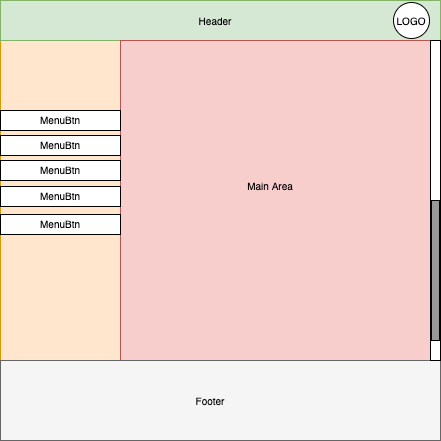
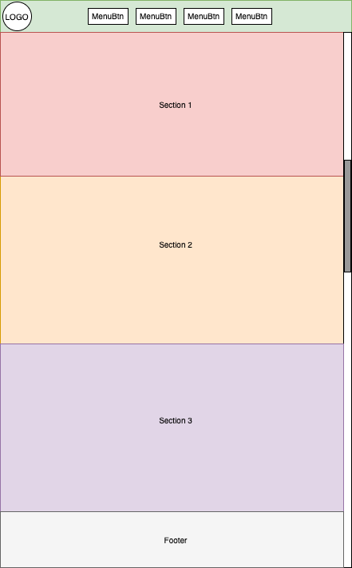

<!-- START doctoc generated TOC please keep comment here to allow auto update -->
<!-- DON'T EDIT THIS SECTION, INSTEAD RE-RUN doctoc TO UPDATE -->
**Table of Contents**  *generated with [DocToc](https://github.com/thlorenz/doctoc)*

- [DH - Fundamentals: HTML and CSS Review and Exercises (8TU)](#dh---fundamentals-html-and-css-review-and-exercises-8tu)
  - [Objectives](#objectives)
  - [Assessment 1](#assessment-1)
      - [Topics](#topics)
    - [Creating Web Page Layouts with HTML and CSS](#creating-web-page-layouts-with-html-and-css)
      - [Topics](#topics-1)
  - [Additional Learning Material](#additional-learning-material)
  - [Exercises](#exercises)
    - [1 - Creating Layouts: Playing with Boxes](#1---creating-layouts-playing-with-boxes)
      - [a) Layout 1: Dashboard](#a-layout-1-dashboard)
      - [b) Layout 2: Landing Page](#b-layout-2-landing-page)

<!-- END doctoc generated TOC please keep comment here to allow auto update -->

# DH - Fundamentals: HTML and CSS Review and Exercises (8TU)

## Objectives

- Assessment 1
- Practice HTML and CSS by creating real-world layouts using the CSS Box Model

## Assessment 1

- Type: Assessment
- Time Units: 1 TU

#### Topics

- Viewing and Navigating
- Creating, Manipulating and Installing
- Versioning and Collaboration

### Creating Web Page Layouts with HTML and CSS

- Type: Exercises (6TU) + Mentoring (1TU)
- Time Planned: 7 TU

#### Topics

- Creating a dashboard layout for a Web Page.
- Creating a Landing Page layout for a Web Page.

## Additional Learning Material

- [CSS Tricks: display](https://css-tricks.com/almanac/properties/d/display/) - All you need to know 
  about the CSS display property. **NOTE:** that this is an entry point for more detailed articles on 
  each type of *display*, check the links!
- [CSS Tricks: Positioning]() - Article about positioning of CSS Boxes. **NOTE:** At the end of the article
  you will find link to other articles related to positioning.
- [HTML Cheat Sheet](https://htmlcheatsheet.com/HTML-Cheat-Sheet.pdf)
- [CSS Cheat Sheet](http://www.cheat-sheets.org/saved-copy/css_cheat_sheet.pdf)

## Exercises

### 1 - Creating Layouts: Playing with Boxes

Using CSS and HTML try to create two different pages  `page1.html` and `page2.html` according 
to the figures below:

#### a) Layout 1: Dashboard 

#### b) Layout 2: Landing Page

