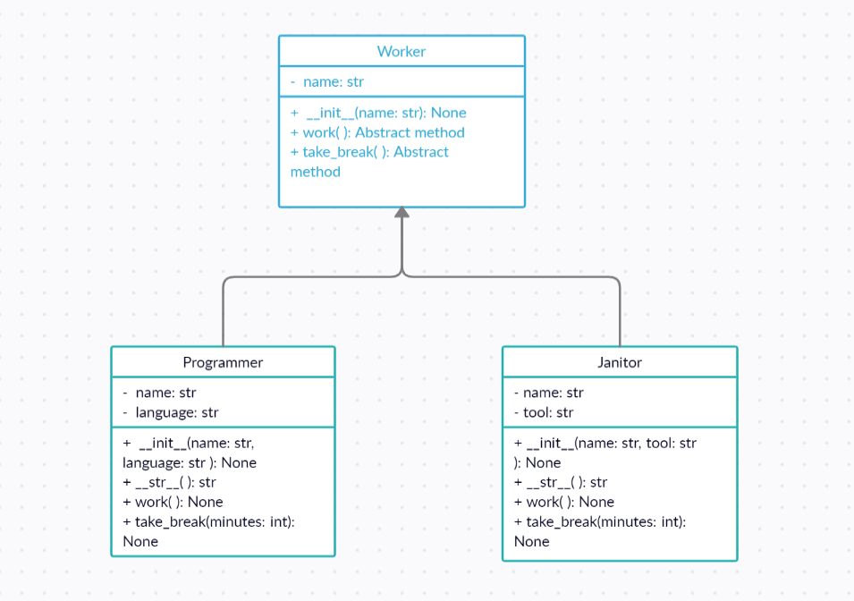

<!-- START doctoc generated TOC please keep comment here to allow auto update -->
<!-- DON'T EDIT THIS SECTION, INSTEAD RE-RUN doctoc TO UPDATE -->
**Table of Contents**  *generated with [DocToc](https://github.com/thlorenz/doctoc)*

- [Task 1](#task-1)
  - [Abstract Method Implementation](#abstract-method-implementation)
- [Task 2](#task-2)
  - [abc module](#abc-module)
  - [Implementation Overview](#implementation-overview)

<!-- END doctoc generated TOC please keep comment here to allow auto update -->

# Task 1
## Abstract Method Implementation

In the file ``src/tool.py``, we have defined an abstract class ``Tool``, with one abstract method ``work``:

```python
class Gadget:
    def work(self):
        raise NotImplementedError("Abstract Method not implemented")
```

- [ ] Implement the subclass ``Laptop`` with a method ``work()``, in order to prevent the ``NotImplementedError`` exception from being raised:

```python
# Write your code here to implement the Laptop class correctly
class Laptop:
    pass
```
- Note: In the ``work()`` method of the subclass ``Laptop``, you can call a simple function such as `print("Laptop is running")`.

To test your code, run the command:
```
python src/check_1.py
```

# Task 2
## abc module
Consider the following class diagram:


The class ``Worker`` is the abstract base class and its subclasses are ``Programmer`` and ``Janitor``.
Complete the code in file ``src/worker.py`` so that:
- [ ] The class ``Worker`` is an abstract class i.e., it inherits from the *Abstract Base Class* ``ABC``.
- [ ] The methods ``work()`` and ``take_break()`` are abstract. *What should you add?*

```python
# Complete the class Worker
class Worker:
    def __init__(self, name):
        self.name = name

    def work(self):
        print(f"\n\n{self.name} starts working:")

    def take_break(self, minutes):
        print(f"\n\n{self.name} takes {minutes} minutes break:")
```
---
The class ``Programmer`` is a subclass of ``Worker``. It is not completed yet:
```python
# Complete this class, so that it would work properly. Implement the missing methods
class Programmer(Worker):
    def __init__(self, name, language):
        super().__init__(name)
        self.language = language

    def __str__(self):
        return f"{self.name} codes with {self.language}"
```

The ``__init__()`` method is overridden so that the class ``Programmer`` has an attribute ``language``.

- [ ] Complete the implementation of class ``Programmer`` and implement its methods properly. Feel free to use your own print statements e.g. `print("The programmer is coding")`.
---
In the file ``src/worker.py``, the class ``Janitor`` should be a subclass of ``Worker``:
```python
# Complete the class Janitor.
# Janitor is a subclass of the class Worker
# work(): Janitor fixes pipes with "tool"
# take_break(): Janitor listens to music
class Janitor:
    def __init__(self, name, tool):
        super().__init__(name)
        self.tool = tool

    def __str__(self):
        return f"{self.name} uses {self.tool}"
```
- [ ] Complete the code above to implement the class ``Janitor`` and all its methods: ``__init__()``, ``__str__()``, ``work()``, ``take_break()``.

## Implementation Overview
``__init__(str, str): None``: Instantiate object ``Janitor`` with arguments ``name`` and ``tool``.

``__str__(): str``: Return a string representation of the object.

``work(): None``: Override the abstract method ``work()`` and add a print statement similar to `print(f"Janitor is working with {tool}")`.

``take_break(int): str``: Override the abstract method ``take_break()`` and add a print statement similar to `print(f"Janitor is listening to music for {minutes} minutes")`.

To test your code, run the script `check2.py`.
