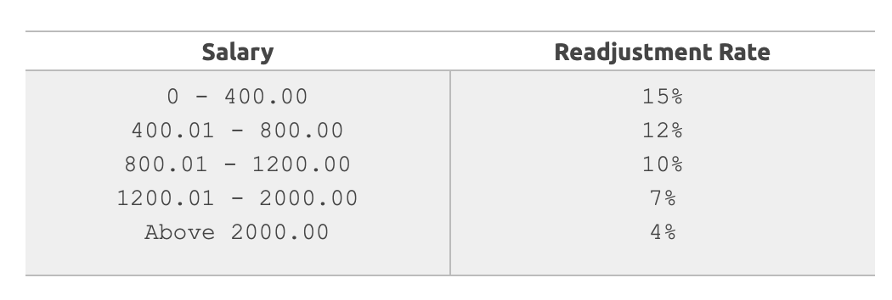

<!-- START doctoc generated TOC please keep comment here to allow auto update -->
<!-- DON'T EDIT THIS SECTION, INSTEAD RE-RUN doctoc TO UPDATE -->
**Table of Contents**  *generated with [DocToc](https://github.com/thlorenz/doctoc)*

- [Exercises](#exercises)
  - [1. Average](#1-average)
    - [Input](#input)
    - [Output](#output)
    - [Samples](#samples)
  - [2. Salary](#2-salary)
    - [Sample](#sample)
      - [Input](#input-1)
      - [Output](#output-1)
  - [3. Salary Increase](#3-salary-increase)
    - [Samples](#samples-1)
      - [Input](#input-2)
        - [Output](#output-2)
  - [4. Positive Numbers](#4-positive-numbers)
      - [Input](#input-3)
      - [Output](#output-3)
  - [5. Area](#5-area)
    - [Input (A, B and C)](#input-a-b-and-c)
    - [Output](#output-4)
  - [6. Consumption](#6-consumption)
    - [Sample](#sample-1)
      - [Input](#input-4)
      - [Output](#output-5)
  - [7. Month](#7-month)
    - [Sample](#sample-2)
      - [Input](#input-5)
      - [Output](#output-6)
  - [8. The One Chance Supermarket](#8-the-one-chance-supermarket)
    - [Try to improve your program](#try-to-improve-your-program)

<!-- END doctoc generated TOC please keep comment here to allow auto update -->

# Exercises

## 1. Average

Create a function that receives two numbers A and B, corresponding to two student's grades and
calculates the student's average, considering that grade A has weight 3.5 and B 
has weight 7.5. Each grade can be from zero to ten, always with one digit after the decimal point.

**Important:** Read the numbers in the main section of your program and call the function there. 

### Input

The input is 2 numbers with one digit after the decimal point.

### Output

Print the message "AVERAGE" and the student's average according to the following example, with 5
digits after the decimal point and with a blank space before and after the equal signal.

### Samples
```
5.0
7.1
AVERAGE = 6.43182
```
```
0.0
7.1
AVERAGE = 4.84091
```

```
10.0
10.0
MEDIA = 10.00000
```

## 2. Salary

Write a program that reads an employee's number, his/her worked hours number in a month and the amount he received per
hour. Print the employee's number and salary that he/she will receive at end of the month, with two decimal places.

The user will type 3 values, representing the number, worked hours amount and the amount the employee receives
per worked hour. The program will print the number and the employee's salary.

### Sample

#### Input

```
25
100
5.50
```

#### Output

```
EMPLOYEE NUMBER = 25
SALARY = U$ 550.00
```

## 3. Salary Increase

The company ABC decided to give a salary increase to its employees, according to the following table:




Read the employee's salary, calculate and print the new employee's salary, as well the money earned and the increase
percentual obtained by the employee, with corresponding messages in Portuguese, as the below example.

### Samples

#### Input
```
 400.00
``` 

##### Output
New Salary: 460.00
Increase: 60.00
Readjustment Rate: 15 %

## 4. Positive Numbers

Write a program that reads 6 numbers. These numbers will only be positive or negative (disregard null values). Print the
total number of positive numbers.

#### Input

```
7
-5
6
-3.4
4.6
12
```

#### Output

```
4 positive values
```

## 5. Area

Make a program that reads three values: A, B and C. Then, calculate and show:
1. the area of the rectangle triangle that has base A and height C.
2. the area of the radius's circle C. (pi = 3.14159) 
3. the area of the trapezium which has A and B by base, and C by height.
4. the area of the square that has side B.
5. the area of the rectangle that has sides A and B.

### Input (A, B and C)

```
3.0 
4.0 
5.2
```

### Output

```
TRIANGLE: 7.800
CIRCLE: 84.949
TRAPEZIUM: 18.200
SQUARE: 16.000
RECTANGLE: 12.000
```

## 6. Consumption

Calculate a car's average consumption being provided the total distance traveled (in Km) and the spent fuel total (in
liters). The program will receive two values from the user: one number representing the total distance (in Km), and 
the second one is a number representing the spent fuel total.

Present a value that represents the average consumption of a car with 3 digits after the decimal point, followed by the
message "km/l".

### Sample

#### Input

```
500
35.0
```

#### Output

```
14.286 km/l
```

## 7. Month

Read an integer number between 1 and 12, including. Corresponding to this number, you must print the month of the year,
in english, with the first letter in uppercase. The input contains only an integer number. Print the name of the month
according to the input number, with the first letter in uppercase.

### Sample

#### Input

```
4
```

#### Output

```
April
```

## 8. The One Chance Supermarket

The "One Chance supermarket" is very strange. You go through a corridor divided in sections, and you have only one
opportunity to pick up one single product in each section. It has 5 sections, grocery, milk products, candies, health,
and drinks. Write a program that will ask the client what the client wants to take in each section. Each section show a
menu, then te user select one product, and the menu for the next section is presented to the user, until the last menu.
Print on the screen the price of the selected product, each time the user selects one product. Create one function per
section, example `def grocery()`, `def milk_products()`, etc.

### Try to improve your program

If you finished the exercise, try to improve it by creating a variable that will accumulate the price of the products
chosen, and print the total price at the end of the program.
